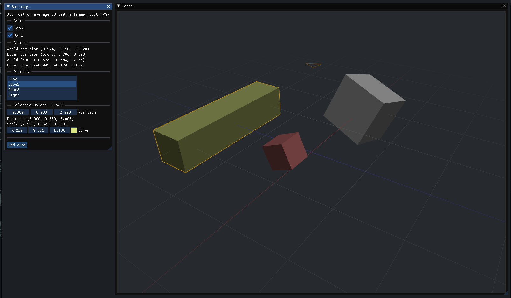
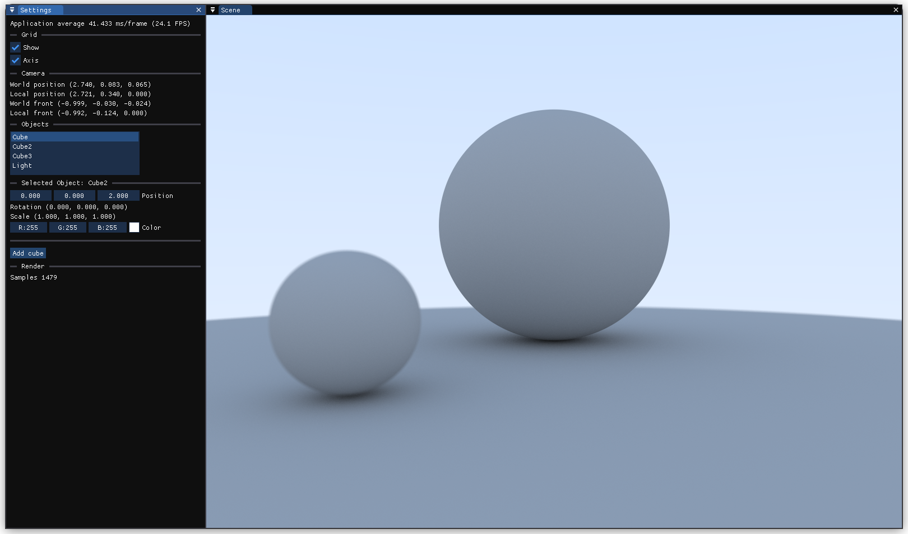
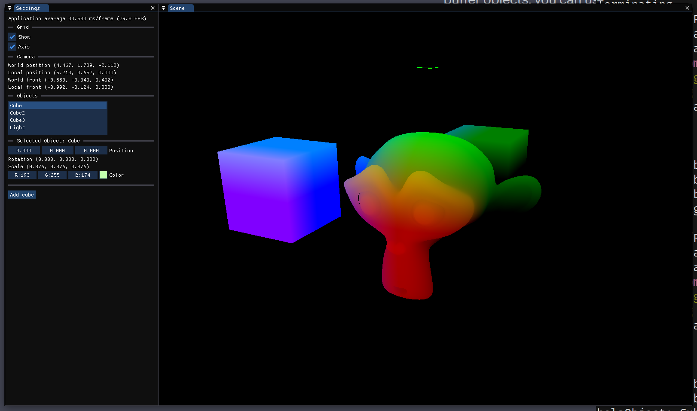
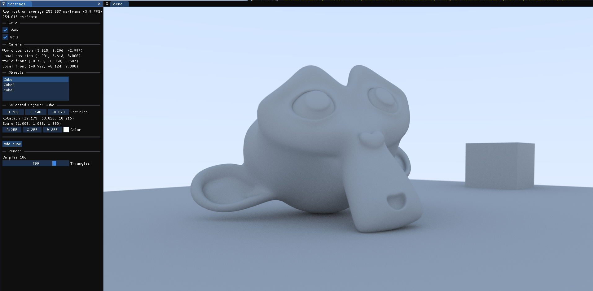

# Demo Raytracer

This project is an renderer based on raytracing techniques, developed using C++ and OpenGL. It allows for the creation of images by simulating the behavior of light as it interacts with objects in a scene. The user can transform the multiple objects in the scene by translating, rotating and scaling them. The look and feel of the whole software takes inspiration from Blender.

## Screenshots

An example of the workbench where the user can edit the scene.
 

A static screenshot of the raytracer renderer.
 

A custom shader used for debugging purposes.
 

Suzanne imported to the renderer.

## Features

- **Live raytracing algorithm**: Utilizes raytracing to simulate the path of light rays in the scene, calculating color contributions from various light sources and surface properties.
- **GPU rendering**: Utilizes OpenGL for efficient rendering and visualization of the scene.
- **BVH acceleration structure**: Builds a BVH to increase the perforance of the triangle-ray intersections.
- **OBJ importer for complex meshes**: Capable of rendering scenes containing complex geometries.

## Getting Started

To get started with the raytracer renderer, follow these steps:

1. Clone the Repository: Clone the repository to your local machine.
2. Create an `external` folder with the external dependencies source code.
2. Build the Project: Build the project using your preferred build system (e.g., CMake, Makefile).
4. Run Renderer: Run the renderer executable.

## Dependencies

This project depends on the following external libraries:
- [glad](https://glad.dav1d.de/)
- [glm](https://github.com/g-truc/glm)
- [imgui](https://github.com/ocornut/imgui)
- [glfw3](https://www.glfw.org/) 
- [assimp](https://github.com/assimp/assimp)

## Controls

**View**:
- Orbit the scene with the mouse middle button.
- Zoom in and out with the mouse wheel.

**Transform**:
- `g` to move selected object.
- `g` + `x` to restrict movement to the X axis.
- `g` + `y` to restrict movement to the Y axis.
- `g` + `z` to restrict movement to the Z axis.
- `r` to rotate selected object.
- `r` + `x` to restrict rotation to the X axis.
- `r` + `y` to restrict rotation to the Y axis.
- `r` + `z` to restrict rotation to the Z axis.
- `s` to scale selected object.
- `s` + `x` to restrict scaling to the X axis.
- `s` + `y` to restrict scaling to the Y axis.
- `s` + `z` to restrict scaling to the Z axis.

**Switch rendering mode**:
- `m` to toggle between raytracer and workbench rendering engines.

## References

- [Learn OpenGL](https://learnopengl.com/)
- [Physically Based Rendering: From Theory To Implementation](https://www.pbr-book.org/) 

